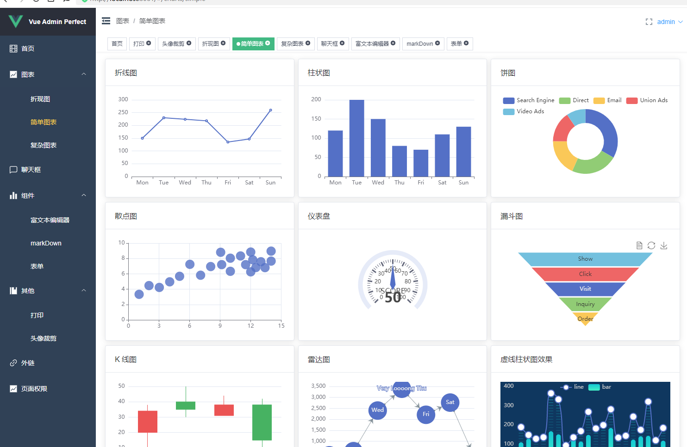
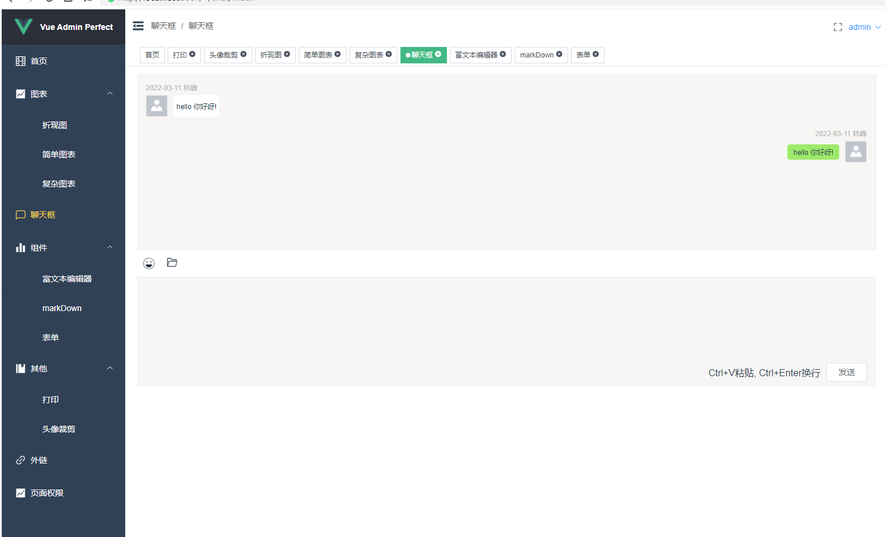
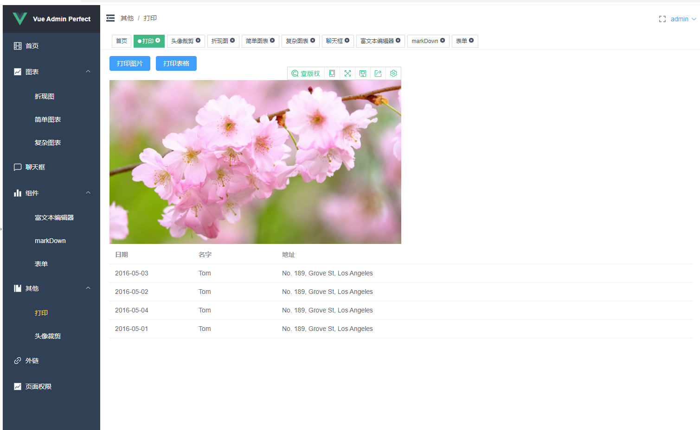

# 基于Vue3.0+TS+Element-plus实现后台管理系统

## 效果预览
- 首页


- 图表页







进行预览 [项目预览地址](https://zouzhibin.github.io/vue-admin-perfect/#/home)

附上github地址 [vue-admin-perfect](https://github.com/zouzhibin/vue-admin-perfect)


## 技术栈
vue3 Typescript vuex vue-router  Element Plus scss

## 安装项目
```
# 克隆项目
git clone -b vue3.0-antdv https://github.com/chuzhixin/vue-admin-better.git
# 安装依赖
yarn install
# 本地开发 启动项目
yarn serve
```

### 打包
```
yarn build
```

